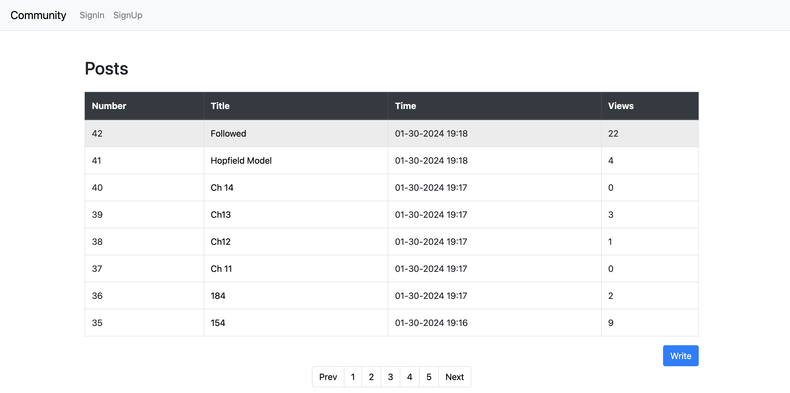
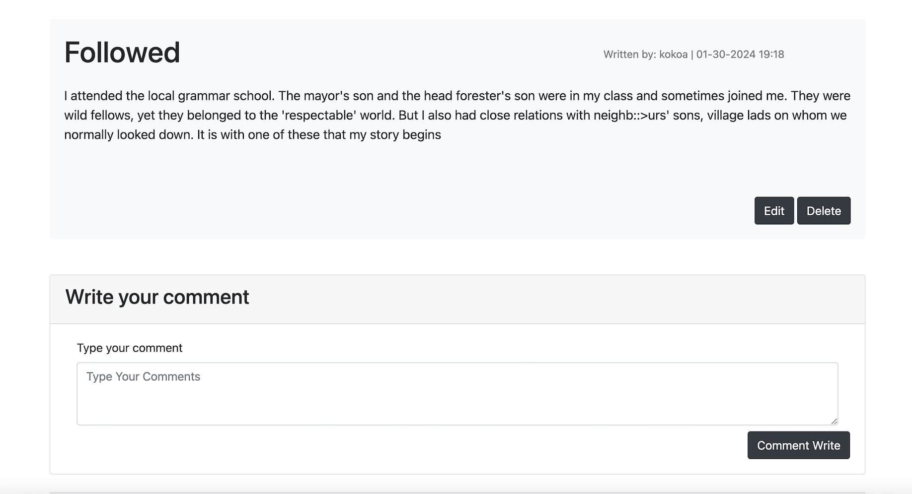
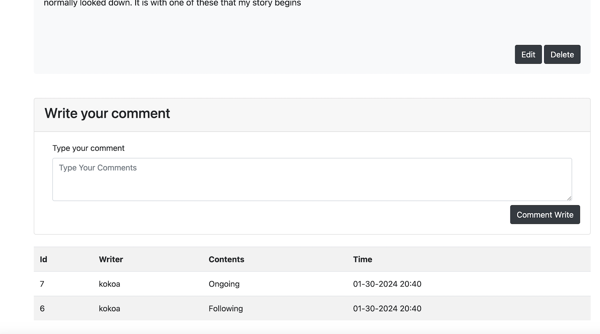

<head>
  

</head>
Social Network Service using Springboot
=======
## Environments
1. IDE: Intellij Ultimate
2. SpringbootVersion:3.2.1
3. JDK 17

## Backend
1. Database: Mysql
2. Spring Boot 3.2.1

## Frontend
1. HTML(thymeleaf)
2. CSS, BootStrap
3. JavaScript

## Testing
1. implement tests for controller, service and repository layers

## Functionality
1. Unauthenticated user can view posts
2. Only authenticated user can write and update the post( user can only update or delete the post they wrote )
3. updating views whenever user visit the posts
4. CRUD comments for posts
5. pagination ( 8posts per page )
6. Validate Signup and Signin Using custom SpringSecurityConfiguration and UserDetailService

- HomePage 
{: height="75px" width="300px" style="float:left; padding-right:10px" }

- Page for writing posts
{: height="75px" width="300px" style="float:left; padding-right:10px" }

- You can comment on posts
{: height="75px" width="300px" style="float:left; padding-right:10px" }

